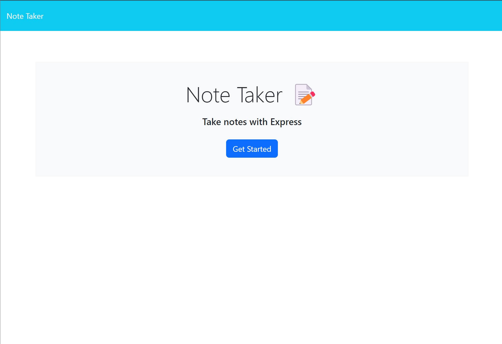
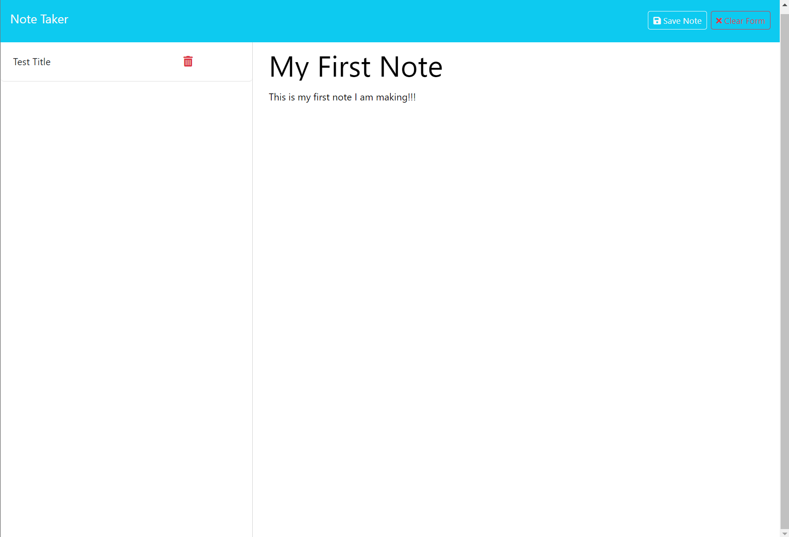
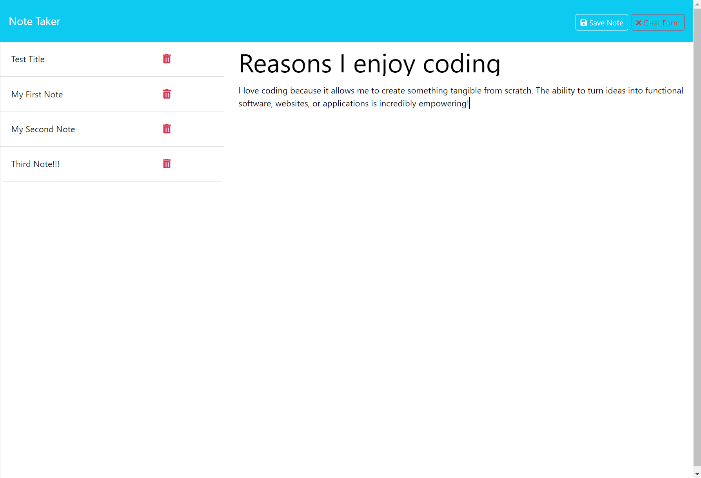

# Note Taker

## Description

This application, Note Taker, allows users to write, save, and manage notes. It utilizes an Express.js back end to handle data storage and retrieval, with notes being saved to a JSON file. The front end has been pre-built, and the task involves building the back end, connecting it to the front end, and deploying the application to Render.

## Table of Contents

- [Description](#description)
- [User Story](#user-story)
- [Acceptance Criteria](#acceptance-criteria)
- [Installation](#installation)
- [Usage](#usage)
- [Deployment](#deploy)
- [ScreenShots](#screenshots)
- [Credits](#credits)

## User Story

As a small business owner, I want to be able to write and save notes so that I can organize my thoughts and keep track of tasks I need to complete.

## Acceptance Criteria

- Given a note-taking application
  - When I open the Note Taker, then I am presented with a landing page with a link to a notes page.
  - When I click on the link to the notes page, then I am presented with a page with existing notes listed in the left-hand column, plus empty fields to enter a new note title and the note’s text in the right-hand column.
  - When I enter a new note title and the note’s text, then a "Save Note" button and a "Clear Form" button appear in the navigation at the top of the page.
  - When I click on the Save button, then the new note I have entered is saved and appears in the left-hand column with the other existing notes, and the buttons in the navigation disappear.
  - When I click on an existing note in the list in the left-hand column, then that note appears in the right-hand column and a "New Note" button appears in the navigation.
  - When I click on the "New Note" button in the navigation at the top of the page, then I am presented with empty fields to enter a new note title and the note’s text.

## Installation

1. Clone the starter code repository:
   ```bash
   git clone <starter-code-repository-url>

2. Create your own repository and push the cloned starter code to it.
3. Navigate to the cloned repository:
    ````bash
   cd note-taker

4. Install the necessary dependencies:
    ````bash
    npm install

## Usage
1. Start the server:
  ````bash
  npm start
  ````
2. Open your browser and navigate to http://localhost:3000.
3. Use application to write, save, and manage notes.


## Deploy 

1. Ensure all changes are committed and pushed to your repository.
2. Deploy the application to Render:
- Create a new web service on Render.
- Connect your repository.
- Follow the prompts to deploy the application.

## Screenshots
 - Home Page

 - Single Note

 - Multipule Notes

## Credits

Special thanks to my teachers, Drew and Kyle, for their guidance and support in teaching me the right methods to complete this module. Drew's speed runs were particularly helpful.